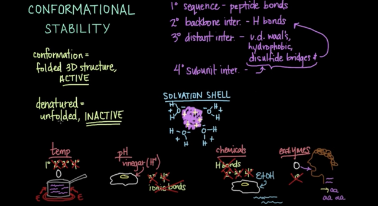
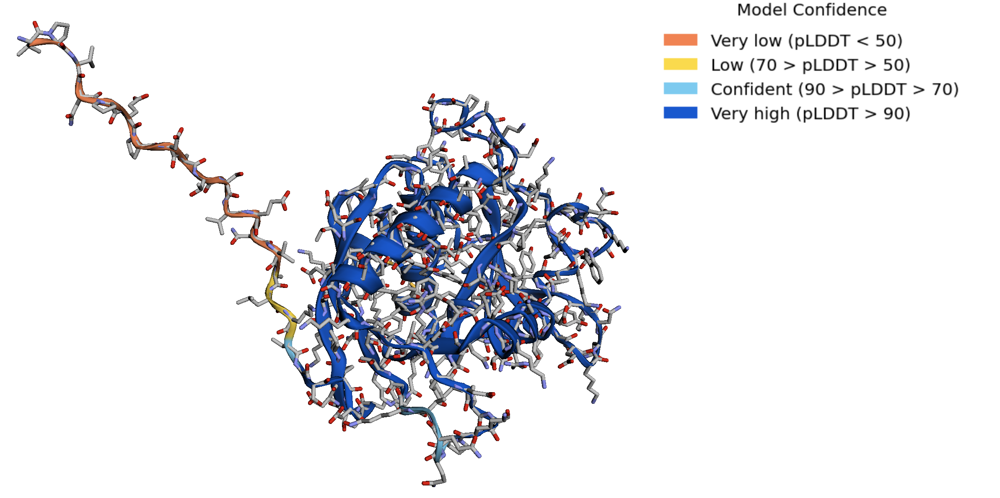
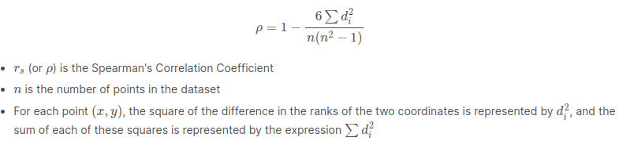

# Kaggle-Novozymes-Enzyme-Stability-Prediction

[kaggle page](https://www.kaggle.com/competitions/novozymes-enzyme-stability-prediction/code?competitionId=37190&sortBy=voteCount)

[referenced code](https://www.kaggle.com/code/dschettler8845/novo-esp-eli5-performant-approaches-lb-0-451)

## 執行環境

1. Tool : Pipenv
2. python version: python 3.8
3. 安裝所需套件: :point_right: 可能會花比較久的時間，因為蠻多套件的

    ```bash=
    pipenv install
    ```

4. 執行 entrypoint

    ```bash=
    pipenv run python xxx.py
    ```

## 題目介紹

### :one: BASIC COMPETITION INFORMATION

#### PRIMARY TASK DESCRIPTION

:star: 目標: **<font color="red">predict the thermal stability of enzyme variants</font>**  ( <font color="#6fffe9">預測酶變體的熱穩定性</font> )

- In this competition, you are asked to develop models that can **predict the ranking of protein stability** (as measured by melting point (熔點),tm) after single-point amino acid mutation and deletion.

#### BASIC BACKGROUND INFORMATION

1. `Enzymes`: Enzymes are proteins that act as catalysts in the chemical reactions of living organisms. ( <font color="#6fffe9">酶是在生物體的化學反應中充當催化劑的蛋白質</font> )

---------------------------例子:point_down:----------------------------

2. `Novozymes`: finds enzymes in nature and optimizes them for use in **industry**. ( <font color="6fffe9"> Novozymes 在自然界中發現酶並優化它們以用於工業</font> )

    - In industry, enzymes replace chemicals and accelerate production processes. ( <span style="color:#6fffe9;">在工業中，酶取代化學品並加速生產過程</span>)
    - They help our customers make more from less, while saving energy and generating less waste. ( <font color="6fffe9"> 它們幫助我們的客戶用更少的資源創造更多的價值，同時節約能源並減少浪費</font> )
    - Enzymes are widely used in laundry and dishwashing detergents where they remove stains and enable low-temperature washing and concentrated detergents. ( <font color="6fffe9"> 酶被廣泛用於洗衣和洗碗洗滌劑中，它們可以去除污漬並實現低溫洗滌和濃縮洗滌劑</font> )
    - Other enzymes improve the quality of bread, beer and wine, or increase the nutritional value of animal feed. ( <font color="6fffe9"> 其他酶可改善麵包、啤酒和葡萄酒的品質，或增加動物飼料的營養價值</font> )
    - Enzymes are also used in the production of biofuels where they turn starch or cellulose from biomass into sugars which can be fermented to ethanol. ( <font color="6fffe9"> 酶也用於生產生物燃料，它們將生物質中的澱粉或纖維素轉化為糖，然後再發酵成乙醇</font> )

:pencil: 這些只是我們向 40 多個不同行業銷售酶的幾個例子。

---------------------------例子:point_up:----------------------------

3. 動機:
    - 前情提要： Novozymes supplies a range of microorganisms for use in agriculture, animal health and nutrition, industrial cleaning and wastewater treatment.
    - `However, many enzymes are only marginally stable, which limits their performance under harsh application conditions.` ( <font color="6fffe9"> 然而，許多酶只是勉強穩定，這限制了它們在苛刻應用條件下的性能</font> )
        - Instability also decreases the amount of protein that can be produced by the cell.
    - Therefore, the development of efficient computational approaches to predict protein stability carries enormous technical and scientific interest. ( <font color="6fffe9"> 因此，開發預測蛋白質穩定性的有效計算方法具有巨大的技術和科學意義。</font> )

4. 方法:

    - physics-based methods (物理方法):  [FoldX](https://foldxsuite.crg.eu/)、[Rosetta](https://www.rosettacommons.org/software)
    - machine learning methods (機器學習方法): [AlphaFold2](https://www.deepmind.com/research/highlighted-research/alphafold)

    :pencil: However, accurate prediction of protein thermal stability remains a great challenge.

#### COMPETITION IMPACT INFORMATION

- applications: `enzyme engineering for addressing the world’s challenges in sustainability`、`carbon neutrality` ...
-

#### COMPETITION HOST INFORMATION

**<font color="red">Novozymes</font> is the world’s leading biotech powerhouse.**

#### VISUAL EXPLANATION



- ALPHAFOLD2 PREDICTION OF WILDTYPE 3D STRUCTURE


### :two: COMPETITION EVALUATION

#### GENERAL EVALUATION INFORMATION

:star: [Spearman's Correlation Coefficient](https://www.wikiwand.com/en/Spearman%27s_rank_correlation_coefficient)

- 公式:



- METRIC DESCRIPTION

- SECONDARY DEFINITION

#### SUBMISSION FILE INFORMATION
